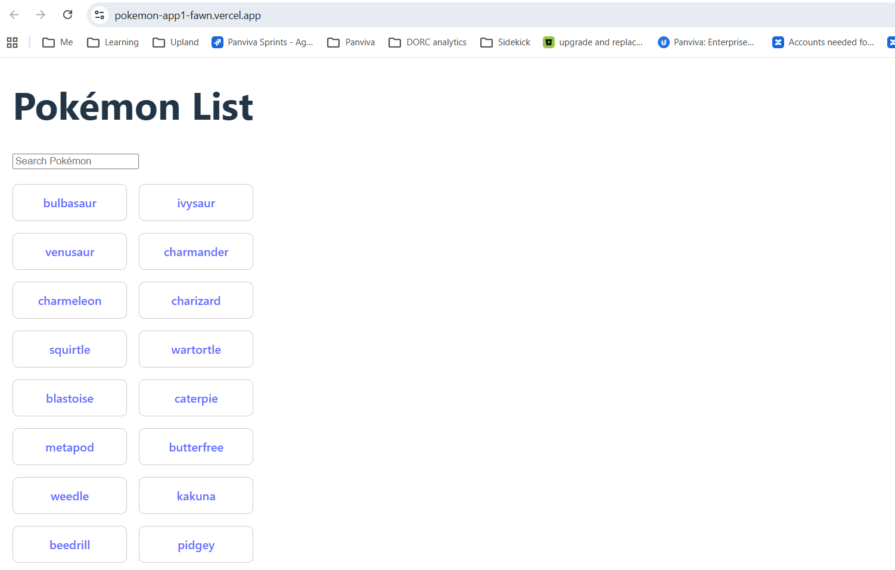

Pokémon Frontend Kata
Live Demo

https://your-deployment-link.vercel.app

Screenshots

### Pokémon List Page

### Pokémon Detail Page

Architecture Decisions

React + TypeScript for type safety
Custom hooks for data fetching
MSW for deterministic test environment
Feature-based folder structure
Strict TDD workflow
GitHub Actions CI for automated validation

Testing Strategy
React Testing Library
MSW for API mocking
Tests focus on:
User behavior
Business logic
Loading states
Error states
High coverage maintained

Run tests:
npm run test
npm run coverage
Setup Instructions
git clone https://github.com/poojakhot4u/pokemon-app
npm install
npm run dev

Trade-offs
Used client-side filtering instead of server-side pagination for simplicity
Fetch API instead of external data libraries to reduce abstraction
Limited dataset to 50 Pokémon for performance

AI Usage Transparency
AI was intentionally used to:
Scaffold test cases
Generate MSW handlers
Draft README structure
Validate edge cases
All generated code was reviewed, refactored, and adjusted manually to ensure correctness and maintainability.